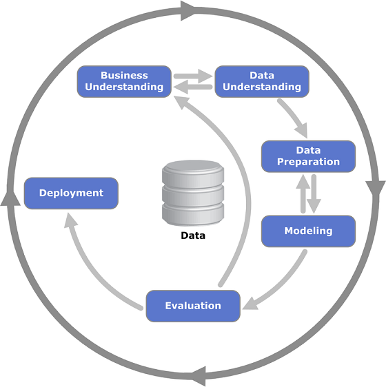
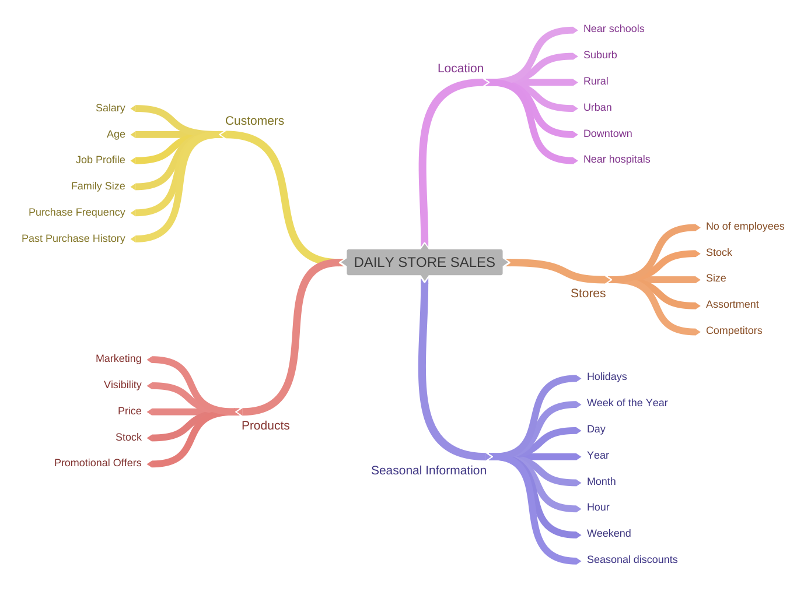
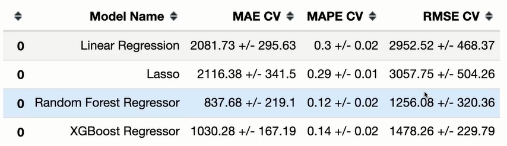
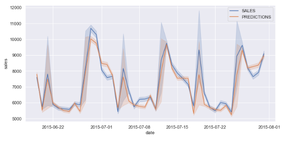
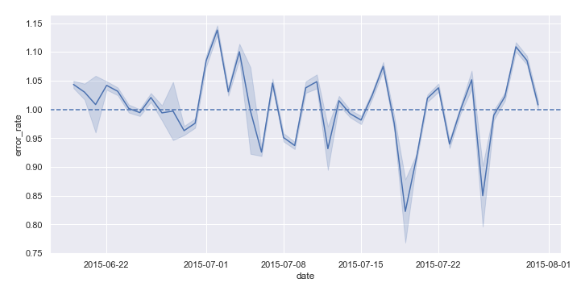
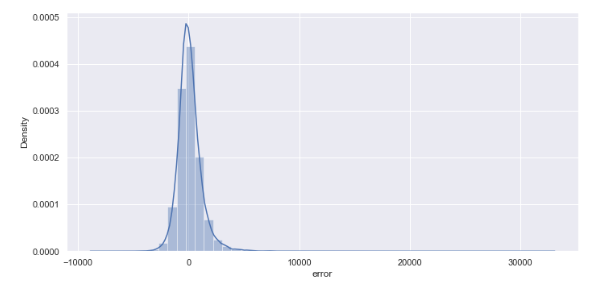
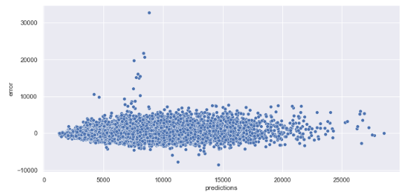
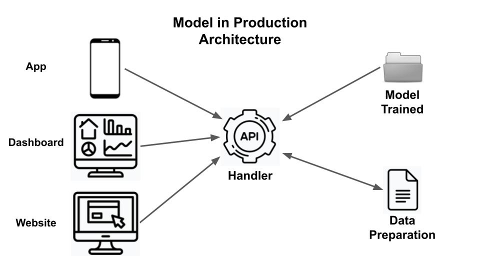
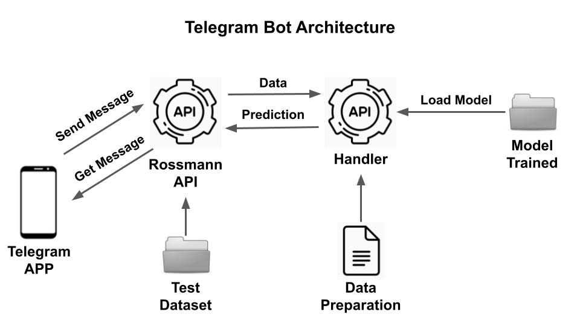
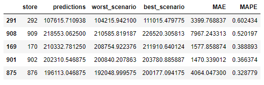

# Welcome to the Rossmann Data Analysis

---
## Table of Contents

[1 - Business Problem](https://github.com/lfreitas16/Sales-Prediction-Rossmann#1---business-problem-)

* [1.1 - Description](https://github.com/lfreitas16/Sales-Prediction-Rossmann#11---description)
* [1.2 - Data Overview](https://github.com/lfreitas16/Sales-Prediction-Rossmann#12---data-overview)

[2 - Business Assumptions](https://github.com/lfreitas16/Sales-Prediction-Rossmann#2---business-assumptions)

[3 - Solution Strategy](https://github.com/lfreitas16/Sales-Prediction-Rossmann#3---solution-strategy)

* [Step 01 - Data Description](https://github.com/lfreitas16/Sales-Prediction-Rossmann#step-01---data-description)
* [Step 02 - Feature Engineering](https://github.com/lfreitas16/Sales-Prediction-Rossmann#step-02---feature-engineering)
* [Step 03 - Filtering Variables](https://github.com/lfreitas16/Sales-Prediction-Rossmann#step-03---filtering-variables)
* [Step 04 - Exploratory Data Analysis](https://github.com/lfreitas16/Sales-Prediction-Rossmann#step-04---exploratory-data-analysis)
* [Step 05 - Data Preparation](https://github.com/lfreitas16/Sales-Prediction-Rossmann#step-05---data-preparation)
* [Step 06 - Feature Selection](https://github.com/lfreitas16/Sales-Prediction-Rossmann#step-06---feature-selection)
* [Step 07 - Machine Learning Modeling](https://github.com/lfreitas16/Sales-Prediction-Rossmann#step-07---machine-learning-modeling)
* [Step 08 - Hyperparameter Fine Tuning](https://github.com/lfreitas16/Sales-Prediction-Rossmann#step-08---hyperparameter-fine-tuning)
* [Step 09 - Performance Evaluation](https://github.com/lfreitas16/Sales-Prediction-Rossmann#step-09---performance-evaluation)
* [Step 10 - Model Deployment](https://github.com/lfreitas16/Sales-Prediction-Rossmann#step-10---model-deployment)
* [Step 11 - Telegram Bot](https://github.com/lfreitas16/Sales-Prediction-Rossmann#step-11---telegram-bot)

[4 - Business Results](https://github.com/lfreitas16/Sales-Prediction-Rossmann#4---business-results)

[5 - Conclusions](https://github.com/lfreitas16/Sales-Prediction-Rossmann#5---conclusions)

[6 - Next Steps to Improve](https://github.com/lfreitas16/Sales-Prediction-Rossmann#6---next-steps-to-improve)

[7 - Technologies](https://github.com/lfreitas16/Sales-Prediction-Rossmann#7---technologies)

[8 - Author](https://github.com/lfreitas16/Sales-Prediction-Rossmann#8---author)

---

## 1 - Business Problem 

### 1.1 - Description
Rossmann is a large German drugstore chain with an online shop and over 3000 stores throughout Europe. It stocks more than 17,500 household, health and beauty lines. 

Rossmann's CFO wants to refurbish the stores and to plan this investment, he asked the managers at a monthly review meeting what the revenue for each store in the next six weeks would be. To answer this question they hired our data consultancy to forecast the sales based on the past years' sales history.

**Disclaimer**: This project is intended for practice and study only.

### 1.2 - Data Overview

The data consists of the historical sales for 1,115 Rossmann stores.

Below is a breakdown of some of the attributes that are not self-explanatory:
| Attribute | Description |
| :----- | :----- |
| Id | an Id that represents a (Store, Date) duple within the test set |
| Store | a unique Id for each store |
| Sales | the turnover for any given day (this is what you are predicting) |
| Customers | the number of customers on a given day |
| Open | an indicator for whether the store was open: 0 = closed, 1 = open |
| State Holiday | indicates a state holiday. Normally all stores, with few exceptions, are closed on state holidays. Note that all schools are closed on public holidays and weekends. a = public holiday, b = Easter holiday, c = Christmas, 0 = None |
| School Holiday | indicates if the (Store, Date) was affected by the closure of public schools |
| Store Type | differentiates between 4 different store models: a, b, c, d |
| Assortment | describes an assortment level: a = basic, b = extra, c = extended |
| Competition Distance | distance in meters to the nearest competitor store |
| Competition Open Since [Month/Year] | gives the approximate year and month of the time the nearest competitor was opened |
| Promo | indicates whether a store is running a promo on that day |
| Promo2 | Promo2 is a continuing and consecutive promotion for some stores: 0 = store is not participating, 1 = store is participating |
| Promo2 Since [Year/Week] | describes the year and calendar week when the store started participating in Promo2 |
| Promo Interval | describes the consecutive intervals Promo2 is started, naming the months the promotion is started anew. E.g. "Feb,May,Aug,Nov" means each round starts in February, May, August, November of any given year for that store |

Data source: [Kaggle](https://www.kaggle.com/competitions/rossmann-store-sales/data)

## 2 - Business Assumptions
* For the missing values in the CompetitionDistance variable, the distance in meters to the nearest competitor store,  we adopt 200,000 m (two hundred thousand meters) as the distance.
* For the missing values in the CompetitionOpenSince[Month/Year] variable, the approximate year and month of the time the nearest competitor was opened, we copied the value from the column Date. The same was done for the variable Promo2Since[Year/Week].

## 3 - Solution Strategy
The CRISP-DM methodology served as the base for this data science project. This process model features six phases to deliver a complete functional solution (end-to-end value) to a business problem. Once we deliver the first solution, we can iterate again, find new insights, tweak parameters, improve performance, and deliver more value. During the project phases we can talk to the stakeholders to update the progress and set expectations.  

CRISP-DM Diagram from Wikipedia  
  

* Business understanding – What does the business need?
* Data understanding – What data do we have / need? Is it clean?
* Data preparation – How do we organize the data for modeling?
* Modeling – What modeling techniques should we apply?
* Evaluation – Which model best meets the business objectives?
* Deployment – How do stakeholders access the results?

To see all the codes and visualizations for the following steps please check the project's [Notebook](Notebook.ipynb).

### Step 01 - Data Description
Goals: Determine how long it will take to solve the problem and estimate computational requirements.
* Rename the columns from their existing state to snake case.
* Check how large the dataset is (in numbers of rows and columns).
* Check the format of the data (numeric or text).
* Deal with missing/null values (NaN). Try to understand why values are missing.
* Find the proportion of each variable type: numerical, categorical, and ordinal.
* Perform descriptive statistics to reduce the data into a simpler summary.

### Step 02 - Feature Engineering
Goal: Have the predictor variables available when exploring the dataset.
* Create a mind map to generate hypotheses: Place the target variable in the center of the map and the agents in the branches. Try to map all the attributes that impact sales.

Mind Map of Hypotheses  
  

* Create a list of  hypotheses: Assume whether the hypothesis will cause more or less sales. Later on, each hypothesis will be validated or discarded to originate an insight.
* Rank the hypotheses on data availability to create a final list.
* Create new variables that will be helpful for our model.
* Transform some variables to create a new set of more effective features.

### Step 03 - Filtering Variables
Goal: Consider data restrictions before exploring the dataset.
* Select the rows for open stores. 
* Select the rows for sales greater than zero.
* Exclude columns already used to create new variables. 
* Exclude columns with a single value.

### Step 04 - Exploratory Data Analysis
Goals: Determine which variables impact the target variable, test hypotheses and better understand the business.

**Univariate Analysis**:
* Plot a distribution graph of the target variable. The less the shape deviates from the normal, the better the model will perform.
* Plot the numerical variables using histograms. Variables with variation (peaks) describe a behavior, and therefore will be more relevant to the model.
* Plot the categorical variables using bar charts and overlapping lines to count the number of observations for each one.

**Bivariate Analysis**:
* Validate each hypothesis using data visualization methods to understand the relationship between each variable and the target variable. Try to derive insights from it.

**Multivariate Analysis**:
* Numerical variables: Plot a correlation heatmap to show the relationships among many variables at the same time. Negative correlations are in black and positive correlations in white.
* Categorical variables: Create a function to calculate the Cramer's V coefficient between two variables. Make all the possible combinations between the variables to create a dataframe and plot a correlation heatmap to identify the features that are suitable for our model training.

### Step 05 - Data Preparation
Goal: Put the variables on the same scale to improve the performance of the machine learning algorithms.
* Check the univariate analysis for normal distributions and choose the variables to normalize. In our case, none of the  variables had a typical normal distribution with standard deviations.
* Convert categorical data to numbers so the model can learn. Convert the actual range of values into a predefined range. For variables with outliers use Robust Scaler, otherwise use MinMaxScaler.
* Select the categorical variables and use One Hot Encoding, Label Encoding, and Ordinal Encoding according to the variable.
* Log-transform the target variable to convert a skewed distribution to a normal distribution.
* Encode the time information to convey its cyclical nature to our model.

### Step 06 - Feature Selection
Goal: Reduce the number of input variables by selecting those that have the strongest relationship with the target variable.
* Split the dataset into train and test sets. The train dataset is used to fit the machine learning model. The test dataset is used to estimate the performance of the machine learning model on data not used to train the model. In our case, it contains the last six weeks of sales.
* Run the Boruta algorithm as the feature selector. It stops either when all features get confirmed or rejected or it reaches a specified limit of random forest.
* Compare the selected columns with the summary of hypotheses from step 4. 
* Decide to keep or not the columns selected. This is our first CRISP iteration, so we can keep only the columns selected by Boruta and add different variables in a second iteration to see if the performance improves.

### Step 07 - Machine Learning Modeling
Goal: Train machine learning algorithms on historical data so they can learn the relationship between input and output and predict future sales.

We chose the following five models because they are faster to implement. The idea was to finish the CRISP first iteration as quickly as possible (business strategy) and deliver the first version of the solution.
* Average Model: The mean of the output value observed in the training data. The baseline that will help us put more complex models into context in terms of precision.
* Linear Regression Model: It can be thought of as finding the straight line that best fits a set of scattered data points.
* Lasso Regression Model: It is a regularization technique used over regression methods for a better prediction.
* Random Forest Regression Model: It is an ensemble of decision trees and a natural extension of bagging.
* XGBoost Regression model: It is an implementation of gradient boosting that can be used for regression predictive modeling.  

* Implement and run the models.
* Implement the function to calculate three types of error to evaluate the performance of all models.
* Compare single performance scores. 

It's noticeable that our target variable is complex, that's why linear models didn't perform so well. 

The RMSE value found does not allow us to draw conclusions about the performance of a model. We need to test the algorithm over more sales weeks, not just the last weeks of the dataset.

* Implement cross validation to assess how well our models perform on unseen data.
* K-Fold method: In k-fold cross-validation, you split the input data into k subsets of data (also known as folds). You train the model on all but one (k-1) of the subsets, and then evaluate the model on the subset that was not used for training. This process is repeated k times, with a different subset reserved for evaluation (and excluded from training) each time.
* Compare the real performance and choose the best model: 

Although Random Forest performed better, we chose XGBoost Regression because decision trees are more computationally expensive to train.

### Step 08 - Hyperparameter Fine Tuning
Goal: Find the ideal configuration of hyperparameters in order to achieve optimal performance.
* Implement Random Search: Set up a grid of hyperparameter values and select random combinations to train the model. The number of search iterations is set based on time/resources.
* Analyze the results: The best score and hyperparameters configuration that achieved the best performance.
* Rerun the final model using the tuned hyperparameters.
* Save the trained model as a pickle file.

### Step 09 - Performance Evaluation
Goal: Use metrics to effectively evaluate our predictive model and verify if it is ready to be brought into production. 

Note that we cannot calculate accuracy for a regression model. The performance of a regression model must be reported as an error.
* Mean Absolute Error (MAE): The average of the sum of absolute difference between the actual values and the predicted values.
* Mean Absolute Percentage Error (MAPE): Measures the error between actual and forecasted values as a percentage. 
* Root Mean Squared Error (RMSE): Square root of the average of the squared difference between the target value and the value predicted.
* Mean Percentage Error (MPE): The mean percentage error (MPE) equation is exactly like that of MAPE. The only difference is that it lacks the absolute value operation. It is useful to us because it allows us to see if our model systematically underestimates (negative error) or overestimates (positive error).
* Build performance visualizations to summarize the measures of error.

Dates vs Sales  
  

Dates vs Error Rate  
  

Error  
  

Predictions vs Error  
  

### Step 10 - Model Deployment
Goal: Save the trained model in a production environment allowing others to request and get the predictions.
* Deploy the model using Flask as an API on Heroku cloud server.

### Step 11 - Telegram Bot
Goal: Create a real data product as the result of a complete data science project that can be accessed by anyone using a device capable of making an API request.
* Build a Telegram bot using Flask and deploy it on Heroku cloud server. 

**Telegram bot demonstration**: Open the chat, write /store_id and click send to get back the sales prediction for the chosen store.

The requested store id may exist in the train dataset, but not in the test dataset. In this case, the user will receive back the following message: "Store Not Available".

You can launch the app here: [Telegram Bot](https://t.me/rossmann_lf_bot)

## 4 - Business Results
The table below shows the best and worst-case scenarios for each store (over or under predicting) sorted by the MAPE.
* The best-case equals the predicted value plus the MAE and the worst-case equals the predicted value minus the MAE.

## 5 - Conclusions
* This data analysis provided a better understanding of the business and validated many assumptions.  
* Future sales were forecast based on historical data.  
* Machine learning forecasting proved to outperform traditional methods.  
* The ultimate goal of these eleven steps presented is to improve business performance. This data product will help the business team make better decisions, attract more customers and consequently more sales.

## 6 - Next Steps to Improve
In the next CRISP iteration we can try to solve the following issues, or at least learn more about them:
* For some stores, the predictions were very off. We can try to understand why they are so hard to predict and maybe implement specific models for them.
* To validate hypothesis 5, which states that stores with more Promo days should sell more, we would have to create a new variable to group the Promo days for each store. We decided to leave this validation for the next iteration.
* Depending on business strategies, we can adjust the model to over or under forecast by analyzing the MPE (Mean Percentage Error).

## 7 - Technologies

## 8 - Author

Leonardo de Freitas  
Aspiring Data Scientist
[GitHub Profile](https://github.com/lfreitas16/)

---
[Return to the table of contents](https://github.com/lfreitas16/Sales-Prediction-Rossmann#table-of-contents)

---